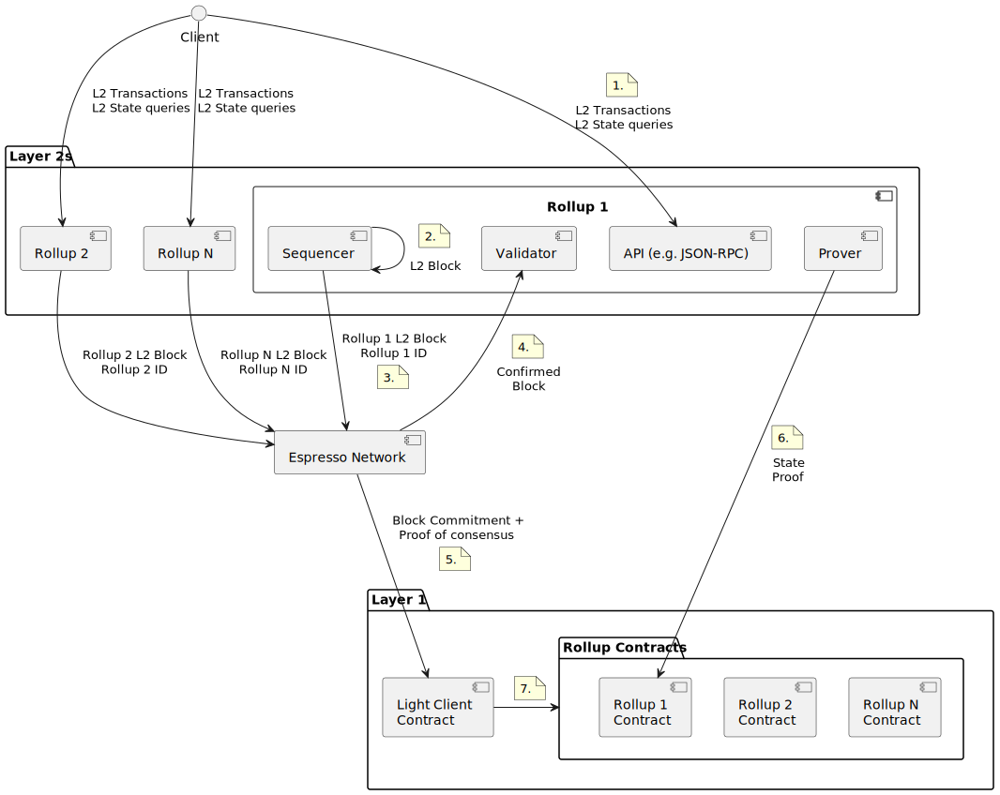

# Espresso Network

The Espresso Network is the global confirmation layer for rollups in the Ethereum ecosystem. Espresso's
[global confirmation layer(GCL)](https://docs.espressosys.com/network) provides agreement on inputs to a collection of
composable blockchains, providing a high trust, fast, and verifiable way to process inputs on any chain, providing fast
confirmations in return.

- [Official Documentation](https://docs.espressosys.com/network/)
- [Rust Documentation](https://espresso-network.docs.espressosys.com/espresso_node/)
- [Smart Contract Documentation](https://espresso-network.docs.espressosys.com/contracts/)

### Architecture

The diagram below shows how the Espresso Confirmation Layer fits into the rollup centric Ethereum ecosystem. See
[Architecture](./doc/architecture.md) for details.

#### ZK rollups integration

In order for ZK rollups to rely on blocks produced by Espresso as a source of transactions, it is required to adjust the
circuit that encodes the state update logic. See [zk-rollups integration](doc/zk-integration.md) for more details.

# Running the demo

Refer to [espresso-example-l2](https://github.com/EspressoSystems/espresso-example-l2) for instructions on how to run
a dockerized Espresso Network with an example Layer 2 rollup application.

# Development

- See [doc/development.md](./doc/development.md).

# License

## Copyright

**(c) 2022 Espresso Systems** `espresso-network` was developed by Espresso Systems. While we plan to adopt an open
source license, we have not yet selected one. As such, all rights are reserved for the time being. Please reach out to
us if you have thoughts on licensing.

# Disclaimer

**DISCLAIMER:** This software is provided "as is" and its security has not been externally audited. Use at your own
risk.

**DISCLAIMER:** The Rust library crates provided in this repository are intended primarily for use by the binary targets
in this repository. We make no guarantees of public API stability. If you are building on these crates, reach out by
opening an issue to discuss the APIs you need.
