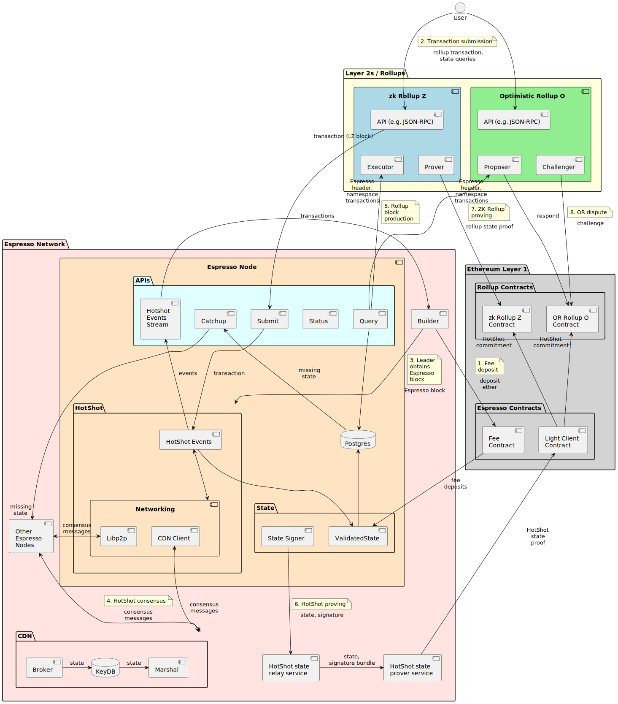

# Espresso Sequencer

The Espresso Sequencer offers rollups credible neutrality and enhanced interoperability, without compromising on scale.
Consisting of a data availability solution and a decentralized network of nodes that sequences transactions, layer-2
rollups can leverage the Espresso Sequencer to give developers and end users fast confirmations, low (and fair) fees,
and robust infrastructure.

[Documentation](https://docs.espressosys.com/sequencer/espresso-sequencer-architecture/readme)



# Running the demo

Refer to [sequencer-example-l2](https://github.com/EspressoSystems/sequencer-example-l2) for instructions on how to run
a dockerized Espresso Sequencer network with an example Layer 2 rollup application.

# Development

- Obtain code: `git clone git@github.com:EspressoSystems/espresso-sequencer`.
- Make sure [nix](https://nixos.org/download.html) is installed.
- Activate the environment with `nix-shell`, or `nix develop`, or `direnv allow` if using [direnv](https://direnv.net/).

## Run the tests

    just pull # to pull docker images
    cargo test --all-features

## Building figures

    make doc

## Building and running

Docker images and the [docker-compose-demo.yaml](docker-compose-demo.yaml) file are provided for convenience. The
Docker-based demo fetches the images from the `ghcr` repository, where they are updated with every push to `main` on
GitHub. For testing uncommitted changes, you can also run the binaries by manually building and running the services.

Build all executables with `cargo build --release`. You may then start a sequencer network. First, start an
orchestrator. Choose a port `$PORT` to run it on and decide how many sequencer nodes `$N` you will use, then run
`target/release/orchestrator -p $PORT -n $N`.

The sequencer will distribute a HotShot configuration to all the nodes which connect to it, which specifies consensus
parameters like view timers. There is a default config, but you can override any parameters you want by passing
additional options to the `orchestrator` executable. Run `target/release/orchestrator --help` to see a list of available
options. Next, you must launch two `web-server` instances, which are necessary to facilitate consensus. One web server
is for data availability, while the other coordinates consensus among sequencer nodes. Pick a `$DA_PORT` and a
`$CONSENSUS_PORT` and run:

```bash
target/release/web-server -p $DA_PORT
target/release/web-server -p $CONSENSUS_PORT
```

Once you have started the orchestrator and the web servers, you must connect `$N` sequencer nodes to them, after which
the network will start up automatically. To start one node, run

```bash
target/release/sequencer \
    --orchestrator-url http://localhost:$PORT \
    --da-server-url http://localhost:$DA_PORT \
    --consensus-server-url http://localhost:$CONSENSUS_PORT \
    -- http --port 8083 -- query --storage-path storage -- submit
```

A useful Bash snippet for running `$N` nodes simultaneously in the background of your shell is:

```bash
for i in `seq $N`; do
    target/release/sequencer \
        --orchestrator-url http://localhost:$PORT \
        --da-server-url http://localhost:$DA_PORT \
        --consensus-server-url http://localhost:$CONSENSUS_PORT
done
```

Note: if the sequencer shows a `"Connection refused"` error you may need to use `127.0.0.1` instead of `localhost` when
connecting to the web server. This is because `localhost` may resolve to `::1` if dual stack (ipv4 and ipv6) networking
is enabled.

### Contracts

#### Development

A foundry project for the contracts specific to HotShot can be found in the directory `contracts`.

To compile

```shell
forge build
```

To run the tests

```shell
forge test
```

In order to avoid constant warnings about checksum mismatches with [svm-rs](https://github.com/roynalnaruto/svm-rs)
managed `solc` we set `FOUNDRY_SRC` to solc installed via flake.nix.

- To use the contrats from rust generate the rust contracts bindings: `just gen-bindings`.

To generate documentation in `./docs` for solidity code run

```shell
forge doc
```

#### Deployment

To deploy the contracts to a local testnet, first run a dev chain (e. g. `anvil`), then run

    forge script DeployHotShot --broadcast --rpc-url local

To deploy to sepolia set `SEPOLIA_RPC_URL` and `MNEMONIC` env vars and run

    forge script DeployHotShot --broadcast --rpc-url sepolia

To additionally verify the contact on etherscan set the `ETHERSCAN_API_KEY` env var and run

    forge script DeployHotShot --broadcast --rpc-url sepolia --verify

Running the script will save a file with details about the deployment in `contracts/broadcast/$CHAIN_ID`.

## Misc

### Authenticate with GitHub container registry

This is only necessary to fetch private images.

- Go to your github profile
- Developer Settings > Personal access tokens > Personal access tokens (classic)
- Generate a new token
  - for the scope options of the token, tick the _repo_ box.
- Run `docker login ghcr.io --username <you_github_id> --password <your_personal_access_token>`

# License

## Copyright

**(c) 2022 Espresso Systems** `espresso-sequencer` was developed by Espresso Systems. While we plan to adopt an open
source license, we have not yet selected one. As such, all rights are reserved for the time being. Please reach out to
us if you have thoughts on licensing.

# Disclaimer

**DISCLAIMER:** This software is provided "as is" and its security has not been externally audited. Use at your own
risk.
