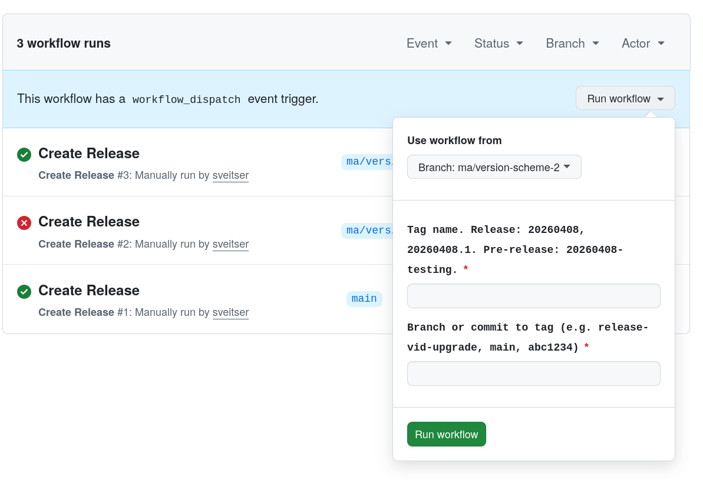
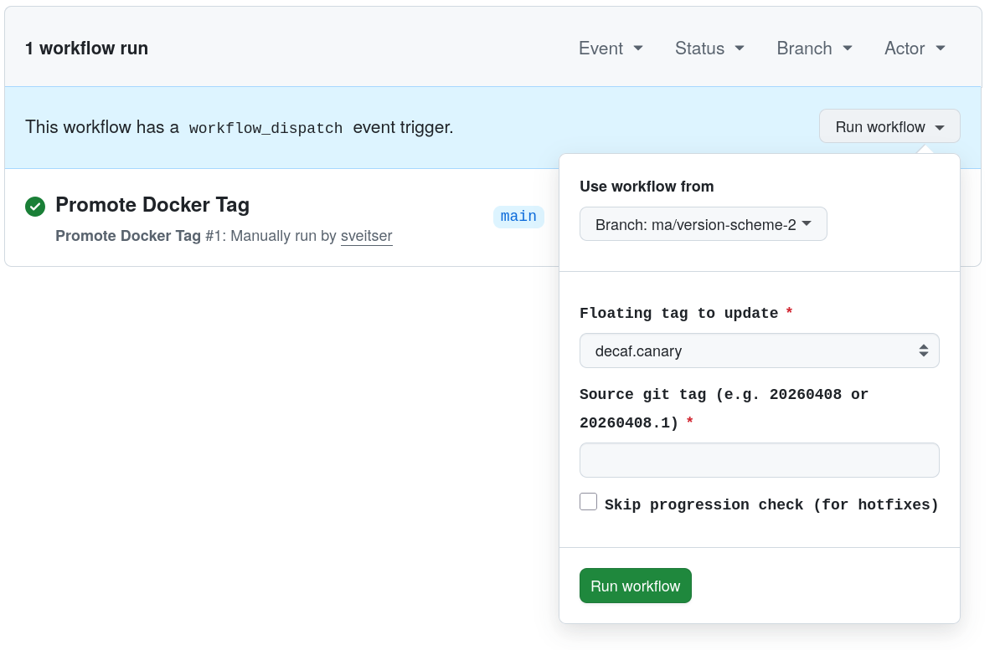

<!-- STATUS: draft, in testing -->

# Release Versioning

```
  Git Tags                            Docker
  --------                            ------

  release branch
       |
       | create-release.yml
       v
  YYYYMMDD-desc  ----build.yml---->  image:YYYYMMDD-desc
  (Pre-release)
       |
       | create-release.yml
       v
  YYYYMMDD       ----build.yml---->  image:YYYYMMDD
  (Release)                               |
                                          | promote + approval
                                          v
                                      decaf.canary
                                          |
                                          | promote + approval
                                          v
                                        decaf
                                          |
                                          | promote + approval
                                          v
                                      mainnet.canary
                                          |
                                          | promote + approval
                                          v
                                       mainnet
```

## Git Tags

Date-based. `-` for internal, `.` for same-day qualifier.

| Git Tag      | GitHub Release | Audience                      |
| ------------ | -------------- | ----------------------------- |
| `YYYYMMDD-*` | Pre-release    | Internal testing              |
| `YYYYMMDD`   | Release        | Recommended for all operators |

Each version is defined once. If a version is broken mid-rollout, create a new version rather than retagging the same
commit. Multiple releases on the same day use `YYYYMMDD.1`, `YYYYMMDD.2`, etc. (these are also classified as Release).

Git tags are created via `create-release.yml`, which requires reviewer approval. The workflow validates the tag format,
classifies it as Release or Pre-release, and creates both the git tag and GitHub Release with auto-generated notes. This
triggers `build.yml`, which builds Docker images tagged with the git tag (e.g. git tag `20260408` produces Docker image
`espresso-node:20260408`).

## Docker Floating Tags

Floating Docker tags track network rollout. They are not git tags and are never created by `build.yml`.

| Docker Tag       | Points to     | Audience                 |
| ---------------- | ------------- | ------------------------ |
| `decaf.canary`   | Latest build  | Canary decaf operators   |
| `decaf`          | Latest stable | Decaf operators          |
| `mainnet.canary` | Latest build  | Canary mainnet operators |
| `mainnet`        | Latest stable | Mainnet operators        |

Canary operators opt into getting new versions first, accepting higher risk. The canary tier is for early feedback.

Floating Docker tags are moved via `promote-docker-tag.yml` (see below).

- Operator docs reference floating Docker tags so they don't need updating on new releases.
- Operators who prefer pinned versions use the date-based Docker image tag and watch GitHub Releases.

Operators may set up automation to auto-upgrade from floating tags. **If a release needs manual operator steps or a
staggered rollout, do not use the floating tags.** Announce on Discord and have operators pin the specific `YYYYMMDD`
tag instead.

## Branches

Release branches start with `release-`.

- Branch off main.
- Fixes from testing go on the release branch.
- Backports from main are cherry-picked: if possible with existing backport action, otherwise manually (use
  `cherry-pick -x`).

## Walkthrough: Cutting a Release

1. Create a new release branch from main, e.g. `release-foo`.

2. Create a pre-release tag via
   [create-release.yml](https://github.com/EspressoSystems/espresso-network/actions/workflows/create-release.yml).

   

   Click "Run workflow" and fill in:
   - **Use workflow from**: always select `main` (this is the branch the workflow itself runs from, not the branch being
     released). The screenshot may show a different branch.
   - **tag**: must start with `YYYYMMDD`. Anything with a `-suffix` is a Pre-release; a bare `YYYYMMDD` is the final
     Release.
   - **ref**: the branch to create the release from, e.g. `release-foo`.

   Hit the green "Run workflow" button.

3. Wait for the automatically dispatched Docker build to complete (~10 minutes). Watch it
   [here](https://github.com/EspressoSystems/espresso-network/actions/workflows/build.yml?query=event%3Aworkflow_dispatch).

4. Test and stabilize the release. If you need more iterations, create additional pre-release tags via step 2 (e.g.
   `YYYYMMDD-test2`, `YYYYMMDD-fix1`).

5. Once stabilized, create the final release tag `YYYYMMDD` via the same
   [create-release.yml](https://github.com/EspressoSystems/espresso-network/actions/workflows/create-release.yml)
   action. Unlike the suffixed tags, a bare `YYYYMMDD` creates a **Release**, not a Pre-release.

6. Promote the floating Docker tags as confidence grows. Promotion re-points the floating tag to the release's image
   (roughly `docker tag $image:YYYYMMDD $image:decaf.canary` + push). Use
   [promote-docker-tag.yml](https://github.com/EspressoSystems/espresso-network/actions/workflows/promote-docker-tag.yml).

   

   Again, always select `main` in the "Use workflow from" dropdown.

   Progression: `decaf.canary` -> `decaf` -> `mainnet.canary` -> `mainnet`. Each step requires approval. For urgent
   hotfixes, set `skip-progression` to bypass the order check (approval still required).

7. After each promotion, post a message on Discord (or run a bot for it).

### If Something Goes Wrong

If a version is broken at any stage, create a new version (`YYYYMMDD.1`, `YYYYMMDD.2`, or next day) rather than trying
to fix it in-flight.

## Create Release Action

`create-release.yml` creates git tags and GitHub Releases. Requires approval via the `release` environment.

Inputs: `tag` (e.g. `20260408`), `ref` (branch or commit to tag).

`gh workflow run create-release.yml -f tag=20260408 -f ref=release-vid-upgrade`

After the git tag and Release are created, the workflow dispatches `build.yml` against the new tag to build Docker
images. This is needed because tag pushes made via `GITHUB_TOKEN` do not trigger other workflows, but
`workflow_dispatch` does.

## Floating Tag Action

`promote-docker-tag.yml` moves floating Docker tags. Re-tags the existing Docker image (no rebuild, just a manifest
pointer). The action's run history serves as the audit trail for which release each network is running.

Inputs: `floating-tag` (one of `decaf.canary`, `decaf`, `mainnet.canary`, `mainnet`), `release-tag` (the git tag to
point to). Only `YYYYMMDD` and `YYYYMMDD.qualifier` tags are promotable; internal `YYYYMMDD-*` tags are rejected.

`gh workflow run promote-docker-tag.yml -f floating-tag=decaf.canary -f release-tag=20260408`

Enforces progression: `decaf.canary` -> `decaf` -> `mainnet.canary` -> `mainnet`. Use `skip-progression` for hotfixes.

### Protection

- **Git tags**: All `YYYYMMDD*` git tags are created via `create-release.yml`, which requires approval through the
  `release` GitHub environment. Direct tag pushes should be blocked by git tag protection rules.
- **Floating Docker tags**: All promotions require approval from a reviewer via the `release` GitHub environment.

The convention is to not self-approve. GitHub does not enforce this, but a second set of eyes is expected.

## Release Status

The `scripts/release-status` helper prints a snapshot of the current release state: where each floating Docker tag
points and when it was last promoted, recent `YYYYMMDD` git tags with their Release/Pre-release classification and
originating branch, and any active `release-*` branches along with tags reachable from them but not from `main`. It uses
`gh` (requires `gh auth login`) and local `git` data. Run it with `just release-status` or `./scripts/release-status`;
pass `--days N` to widen/narrow the window (default 60), `--floating` for only the Docker tag section, `--fetch` to run
`git fetch --tags` first (off by default so repeat runs stay fast), or `--all-branches` to include release branches with
no release tags.
