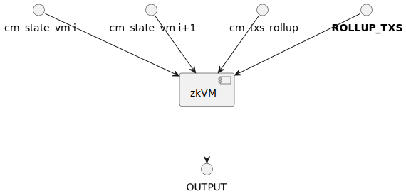
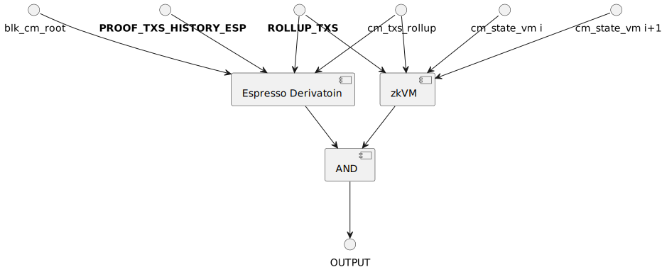

# Integration with ZK rollups

Similarly to their optimistic alternatives, ZK rollups need to instantiate their derivation pipeline in order to
integrate with Espresso. There are a number of alternatives for such integration, depending on specific constraints the
rollup may have such as using a particular data availability layer in addition to Tiramisu, or the need to update their
state at a faster pace than the Espresso light client contract does.

In the following, we assume that the rollup relies on Tiramisu for data availability and explore two different
integrations flavors. With integration 1, the rollup relies on the Espresso light client contract to fetch the latest
Espresso state updates. while with integration 2 the rollup checks Espresso consensus directly inside its circuit.

For both integrations:

- We describe the high level structure of the circuit as well as the rollup L1 contract and how they are related.
- We describe the use of an Espresso liveness escape hatch in the rollup L1 contract.

When the escape hatch is activated, both integrations use the same circuit  
 which corresponds to a mode where the rollup falls back to using its own (centralized) sequencer as shown in Figure 1.



**Figure 1:** Circuit used when the rollup falls back to using its default (centralized) sequencer. The public inputs
are the current state of the rollup _COMM_STATE_VM i_, the new rollup state after update _COMM_STATE_VM i+1_ and a
commitment to the transactions applied to the state, _COMM_TXS_ROLLUP_. The private input (in bold) corresponds the list
of transactions.

## Integration 1: Rollup contract fetches Espresso block commitment from the Espresso light client contract

For this integration, Espresso consensus verification is delegated to the Espresso light client contract. In practice
the rollup contract will fetch the last Espresso block commitment and feed it to the circuit. Still additional gadgets
need to be introduced in order to implement the derivation pipeline logic consisting at a high level in:

- Collecting all the Espresso commitments since the last update.
- For each of these commitments, filter the corresponding Espresso blocks in order to obtain the transactions belonging
  to the rollups.
- Establishing some equivalence between the commitment to the rollup transactions used in the zkVM and the commitment to
  those same transactions obtained after namespace filtering.

 **Figure 2:** Rollup circuit with additional gadgets _Collect &
Filter_, and _COMMs Equivalence_. Private inputs of the circuit are written in bold font.

The circuit depicted in Figure 2 operates as follows:

- The _Collect & Filter_ gadget receives as input _BLOCK_COMM_ESP_NEW_ which is the commitment to the latest Espresso
  block available and _BLOCK_COMM_ESP_OLD_. Both of these commitments are public inputs. The first witness of this
  circuit is _COMM_TXS_HISTORY_ESP_ which is a commitment to all the rollup transactions that have been sequenced since
  the last Espresso state update _BLOCK_COMM_ESP_OLD_. The relationship between _BLOCK_COMM_ESP_, _BLOCK_COMM_ESP_OLD_,
  and _COMM_TXS_HISTORY_ESP_ can be checked using a second witness _PROOF_TXS_HISTORY_ESP_.
- The _COMMs Equivalence_ gadget checks that using the same rollup inputs _ROLLUP_TXS_, we obtain _COMM_TXS_HISTORY_ESP_
  using the Espresso commitment scheme for representing a set of transactions and the commitment _COMM_TXS_ROLLUPS_ that
  is used the by _zkVM_ gadget.
- The _zkVM_ gadget is the original gadget of the rollup circuit that proves a correct transition from state
  _COMM_STATE_VM i_ to the next state _COMM_STATE_VM i+1_ when applying the transactions represented by the commitment
  value _COMM_TXS_ROLLUP_.
- These three gadgets above return a boolean: true if the verification succeeds and false otherwise.
- For the circuit to accept, all these gadget outputs must be true, and thus we add an _AND_ gate.

```solidity
/// Uses the Espresso light client contract to fetch the last state.
contract RollupContract1 {

    VMState previousVMState;
    EspressoState previousEspressoState;
    uint256 lastEspressoBlockNumber;
    LightClient lcContract;

    constructor(address EspressoLightClientAddress,...) public {
        lcContract = LightClient(EspressoLightClientAddress);
        ...
    }

    function updateRollupState(
        newVMState,
        commTxsRollup,
        commTxsEspresso,
        snarkProof){

        // Escape hatch is activated, switch to default sequencing mode
        if lcContract.escapeHatch(lastEspressoBlockNumber, ...){
            bytes[] publicInputs = [
                previousVMState,
                newVMState,
                commTxsRollup,
            ];

            SnarkVerify(
                publicInputs,
                snarkProof,
                vkRollup); // This verification key corresponds to the circuit depicted in Figure 1.
        );

        } else { // No escape hatch, use the state of Espresso consensus

            (newEspressoState,  blockNumberEspresso) = lcContract.getLastBlockCommitment();


            if (blockNumberEspresso <= lastBlockNumberEspresso) {
                revert();
            }

            bytes[] publicInputs = [
                previousVMState,
                newVMState,
                commTxsRollup,
                previousEspressoState,
                newEspressoState
            ];

            SnarkVerify(
                publicInputs,
                snarkProof,
                vkEspresso // This verification key corresponds to the circuit depicted in Figure 2.
            );

            previousEspressoState = newEspressoState;
            lastBlockNumberEspresso =  blockNumberEspresso;

        }

        previousVMState = newVMState;

    }
}

```

## Integration 2: Verify Espresso consensus inside the rollup circuit

 **Figure 3:** Rollup circuit with additional gadgets _Espresso Consensus_, _Collect &
Filter_, and _COMMs Equivalence_. Private inputs of the circuit are written in bold font.

The circuit depicted in Figure 3 operates as follows:

- The _Espresso Consensus_ gadget checks that the block commitment for Espresso block _BLOCK_NUMBER_ESP_ is
  _BLOCK_COMM_ESP_, using the multi-signature _STATE_SIGS_ESP_.
- The _Collect & Filter_ gadget receives as input _BLOCK_COMM_ESP_NEW_ which is the commitment to the latest Espresso
  block available and _BLOCK_COMM_ESP_OLD_. Both of these commitments are public inputs. The first witness of this
  circuit is _COMM_TXS_HISTORY_ESP_ which is a commitment to all the rollup transactions that have been sequenced since
  the last Espresso state update _BLOCK_COMM_ESP_OLD_. The relationship between _BLOCK_COMM_ESP_, _BLOCK_COMM_ESP_OLD_,
  and _COMM_TXS_HISTORY_ESP_ can be checked using a second witness _PROOF_TXS_HISTORY_ESP_.
- The _COMMs Equivalence_ gadget checks that using the same rollup inputs _ROLLUP_TXS_, we obtain _COMM_TXS_HISTORY_ESP_
  using the Espresso commitment scheme for representing a set of transactions and the commitment _COMM_TXS_ROLLUPS_ that
  is used the by _zkVM_ gadget.
- The zkVM gadget is the original gadget of the rollup circuit that proves a correct transition from state
  _COMM_STATE_VM i_ to the next state _COMM_STATE_VM i+1_ when applying the transactions represented by the commitment
  value _COMM_TXS_ROLLUP_.
- These three gadgets above return a boolean: true if the verification succeeds and false otherwise.
- For the circuit to accept, all these gadget outputs must be true, and thus we add an _AND_ gate.

```solidity

/// Does not use the Espresso Light client contract for fetching the state
contract RollupContract2 {

    VMState previousVMState;
    EspressoState previousEspressoState;
    uint256 lastEspressoBlockNumber;
    LightClient lcContract;


    constructor(address EspressoLightClientAddress,...) public {
        lcContract = LightClient(EspressoLightClientAddress);
    }

    function updateRollupState(
            newVMState,
            commTxsRollup,
            newEspressoState,
            blockNumberEspresso,
            snarkProof){

        if lcContract.escapeHatch(lastEspressoBlockNumber,...){
            bytes[] publicInputs = [
                        previousVMState,
                        newVMState,
                        commTxsRollup
                ];

            SnarkVerify(
                publicInputs,
                snarkProof,
                vkRollup // This verification key corresponds to the circuit depicted in Figure 1.
            );

        } else { // No escape hatch, use the state of the Espresso sequencer

            if (blockNumberEspresso <= lastBlockNumberEspresso) {
                revert();
            }

            bytes[] publicInputs = [
                        previousVMState,
                        newVMState,
                        commTxsRollup,
                        previousEspressoState,
                        newEspressoState,
                        blockNumberEspresso,
                    ];

            SnarkVerify(
                publicInputs,
                snarkProof,
                vkEspresso // This verification key corresponds to the circuit depicted in Figure 3.
            );

            previousEspressoState = newEspressoState;
            lastBlockNumberEspresso =  blockNumberEspresso;

        }

        previousVMState = newVMState;
    }

}
```
